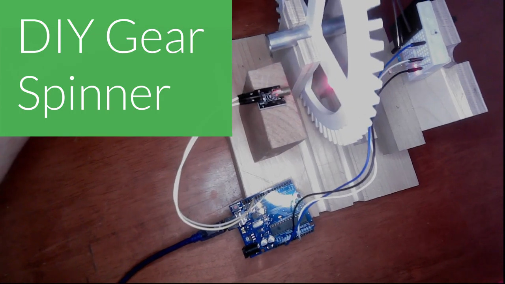

# RPM Sensor with Arduino

This repository has some files related to [this tutorial](https://youtu.be/DEBkFZsOvlw) on creating a revolutions per minute (RPM) sensor using an Arduino board. 

You can find the code used in `rpm_sensor.ino`, a circuit diagram in `circuit.png`, as well as the full video linked above. 

Testing setup for RPM sensor:
